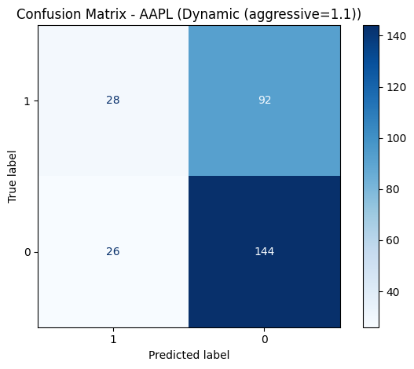
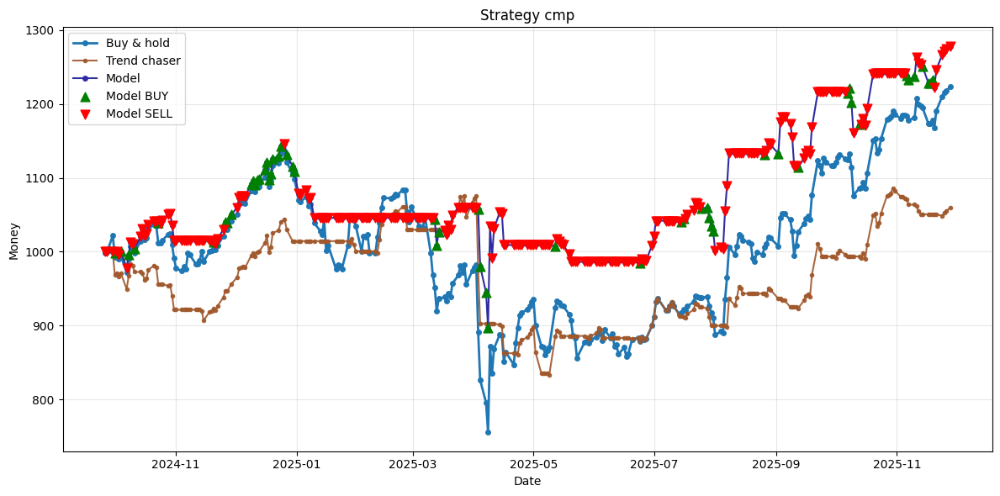
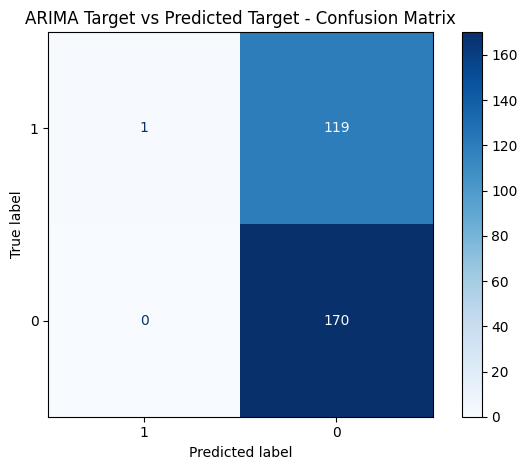
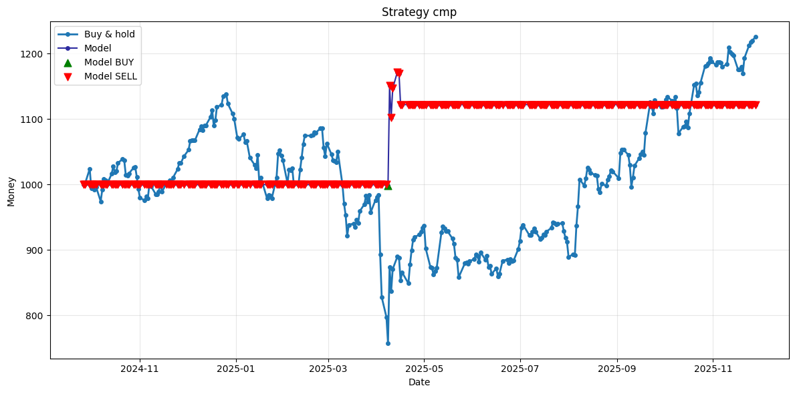
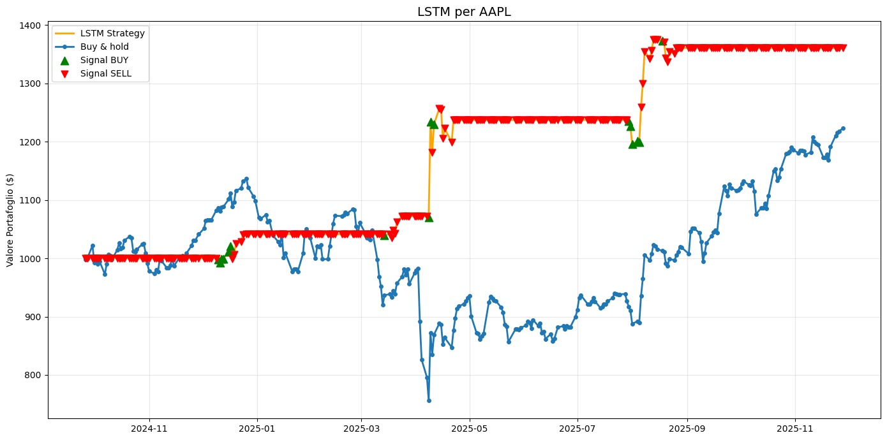

# Documentazione

## Definizione del problema e obiettivi (Problem statement and objectives)

L'obiettivo del progetto è la realizzazione di un classificatore binario in grado di prevedere l'andamento del prezzo di chiusura di una certa azienda, avendo in ingresso una serie di feature e fornendo in uscita segnali di BUY (1, prezzo in salita) o SELL (0, prezzo in discesa), secondo un certo criterio.

### Scelta del Target

La natura del problema e l'ambiente finanziario in cui esso si svolge costituiscono una grande sfida che porta il nostro modello ad affrontare costantemente: **overfitting** e **rumore**.

Dato il target infatti, in qualunque modo esso si ponga, è difficile trovare feature così determinanti da indicare subito la strada per l'obiettivo al modello. 

Per attenuare quanto possibile questa problematica si è giunti a una versione semplificata del metodo della [\underline{Triple Barrier}](https://mlfinpy.readthedocs.io/en/latest/Labelling.html) ovvero la **Double Barrier** :

* dato un giorno vengono esaminati i giorni successivi (di default 5). Si pongono due barriere, una superiore (take profit +2% risp. al Close) e una inferiore (stop loss -1% risp. al Close): se il prezzo tocca prima quella superiore allora l'etichetta del Target sarà 1, se il prezzo tocca per prima quella inferiore o rimane tra le due. l'etichetta sarà 0. 

### Obiettivi secondari

* Realizzare altri modelli alternativi di classi diverse a quella scelta per vedere come le teconologie differenti si comportano sul problema.

* Realizzare un banco di prova per i modelli sviluppati, in modo da vedere il loro comportamento in un contesto di trading simulato e confrontarli con strategie di trading basate su regole semplici.

## Approccio all'analisi dei dati e risultati (Data analysis approach and findings)

La scelta delle features è stata effettuata attraverso la ricerca di indicatori tecnici specifici per il nostro obbiettivo, andando a studiare il dominio e riflettendo su cosa ogni indicatore potesse rappresentare in ambito finanziario. Inoltre abbiamo sperimentato con l'integrazione di indicatori provenienti da altri mercati (ad esempio quelli dell'indice VIX) per vedere se potessero essere significativi rispetto al target.

Molti di questi indici però hanno natura o costruzione simile e rischiano di essere ridondanti. Al fine di aiutare il modello nel perseguire il target si è adotatto un metodo di selezione delle feature basato su tre valutazioni principali:

* **Correlazione lineare**: Attraverso la costruzione di una mappa di correlazione è possibile selezionare ed eventualmente rimuovere le feature che hanno una alta correlazione con altre feature.

* **Mutual Information Score (MI Score)**: questo tipo di valutazione invece mette a confronto la feature presa singolarmente e la correlazione (anche non lineare) che essa ha con il target. In parole povere, quanto quella feature aiuta a identificare il target da sola.

* **Importanza delle feature secondo il modello**: il modello scelto ha una funzionalità di *"feature importance"* che gli permette di dare un valore a una feature sulla base di quanto essa l'ha aiutato nel prevedere il target. Questa metrica va usata con cura poichè prende in considerazione tutte le feature, e quindi può cambiare di molto da un'iterazione all'altra.

### Metodo di analisi e scoperte
Date queste metriche di valutazione le feature sono state scelte attraverso varie prove, tenendo in considerazione la valutazione che ognuna di esse ha ottenuto e i risultati del modello. 

In linea generale ogni criterio di valutazione esposto non basta (da solo) a inquadrare l'utilità di una feature, ma va osservato nell'insieme, soprattutto rispetto a ciò che il modello indica come importante. Preso nota di questo ogni metrica avrebbe una indicazione propria su come gestire una feature:


* **Mappa di correlazione**: analizzando le feature a coppie, nelle coppie con correlazione $\geq 0.9$ (in valore assoluto) si decide di scartarne una.

* **MI score**: le feature con un punteggio scarso o prossimo a 0 possono essere eliminate

* **Feature Importance del modello**: si analizza come l'importanza di ogni feature cambia alla rimozione di altre, rimosse in seguito alla valutazione e applicazione dei criteri esplicitati sopra

Ad esempio un metodo che è stato utilizzato per combinare i tre criteri sopra è il seguente:
Prese le feature con meno importanza per il modello, a parità di MI SCORE uguale a 0 o prossimo a 0, è stata rimossa la feature che compariva più volte tra le coppie a correlazione lineare $\geq 0.9$. Se alla successiva iterazione il modello migliorava i risultati allora si proseguiva altrimenti l'eliminazione veniva annullata. 

Dopo varie iterazioni e uno studio più approfondito del dominio, siamo riusciti a identificare feature significative per il nostro target come le **Bande di Bollinger** (che rappresentano il trend) e feature meno significative come la **Open** che invece sono state rimosse.

## Approccio al Machine learning e risultati (Machine learning methodology and results)

### Scelta del modello (Model choice)

Il modello scelto per questo problema è XGBoost (eXtreme Gradient Boosting) ed è un algoritmo di machine learning supervisionato usato soprattutto per classificazione e regressione. Si basa sul *gradient boosting*, e lo sfrutta attraverso la costruzione di un insieme di alberi decisionali ognuno dei quali cerca di correggere gli errori commessi dai precedenti attraverso la minimizzazione di una funzione di perdita tramite il **gradiente**.

La scelta di questo modello è avvenuta dopo una serie di tentativi più o meno deludenti con altri modelli. Esso
possiede un vasto parco di iperparametri da poter gestire utili a combattere l'overfitting (regolarizzazioni L1 e L2) e può eseguire una valutazione autonoma delle feature più importanti (feature importance).

### Soglia delle previsioni 

Il modello di XGBoost fornisce come risultato una probabilità che un dato campione appartenga alla classe positiva. Dovendo convertire tale probabilità in un segnale 1 o 0 è necessario introdurre una soglia che sancisca questa divisione. Dopo alcuni tentativi con soglia statica è stata introdotta una soglia dinamica che si basa sui valori più recenti restituiti dal modello. Tale soglia viene scelta grazie all'utilizzo del coefficiente di Matthew che fornisce una misura della qualità di una predizione. 

La soglia è stata definita attraverso una metrica nota come _rolling-z-score_. La threshold viene calcolata come la media dei valori ($\mu$) predetti negli ultimi $n$ giorni più $k$ volte la deviazione standard ($\sigma$):
    $$
    threshold = \mu_{\text{su ultimi } n \text{ giorni}} + k \cdot \sigma_{\text{su ultimi } n \text{ giorni}}
    $$ 
$k$ viene scelto sul validation set in modo da massimizzare il coefficente di Matthew.

### Metriche di valutazione del modello
Per valutare i risultati delle predizioni del modello sono state utilizzate diverse metriche (in particolare la *overall accuracy* e la  *precision* sulle singole classi) che accompagnate dalla *confusion matrix* hanno costituito la base per la valutazione del modello, almeno dal punto di vista statistico. 
Per una valutazione più vicina all'applicazione effettiva del modello è stata sviluppata una testbench che si occupa di implementare una semplice logica di investimento basata sulle predizioni del modello. Questa permette di visualizzare un possibile guadagno fornito dall'applicazione del modello.

### Gestione della pipeline (Pipeline management)

Presi i dati a disposizione e noto il target, la pipeline per la creazione (e la raffinazione) del modello è stata realizzata attraverso i seguenti passi:

1. Creazione e aggiunta della colonna *Target* attraverso l'applicazione della **Double Barrier**

2. Divisione del dataset in 3 parti: Train (70%), Validation (15%) e Test (15%). I tre set vengono poi trasformati in matrici, rappresentazione più efficace per XGBoost.

3. Allenamento del modello sui dati di Train con valutazione della `log_loss` sui dati di Validation

4. Ottimizzazione automatizzata degli iperarametri tramite `optuna` il quale tenta di massimizzare la precisione (o altra funzione obiettivo specificata) del modello sul Validation set, attraverso la variazione degli iperparametri in un dominio specificato a priori.

5. Scelta della soglia per le previsioni ($k$).

6. Predizione sui dati di test mai visti dal modello

7. Valutazione delle performance del modello attraverso metriche e testbench

Al termine di una iterazione se ne possono eseguire altre modificando le feature seguendo i criteri di [\underline{feature selection}](#scelta-e-analisi-delle-feature-features-selection-and-analisys) esposti sopra, tentando di ottenere un modello migliore.

## Alcuni risultati 
Come esempio vengono riportati qua sotto i risultati del modello che tenta le previsioni studiando le azioni di *Apple* dal gennaio 2018 al novembre 2024:

```    
Classification Report (Test Set):
                precision    recall  f1-score   support
            1       0.52      0.23      0.32       120
            0       0.61      0.85      0.71       170

     accuracy                           0.59       290
    macro avg       0.56      0.54      0.52       290
 weighted avg       0.57      0.59      0.55       290 
```    

con la seguente matrice di confusione: \newpage



* Poi abbiamo visto anche confrontato il modello con altre strategie, in particolare abbiamo idealizzato una strategia che sfrutta le azioni del modello, analizzata più in dettaglio [\underline{sotto}](#dettagli-tecnici-implementativi-technical-implementation-details)
    

Quello che abbiamo ottenuto sul periodo che va da 2024-09-26 a 2025-11-28, partendo da un buget di 1000$ con commissioni al 0.2% è:

|Strategia|Capitale finale|Rendimento|
|---|---|---|
|Buy and Hold| 1220.71 | 22.071% |
|Trend Chaser| 1059.72 | 5.973% |
|Modello | 1277.69 | 27.769% |

\newpage



## Dettagli tecnici implementativi (Technical Implementation Details)

Il progetto è stato sviluppato in **Python 3.12.3**, utilizzando **uv** come gestore dell’ambiente. Le principali specifiche tecniche sono le seguenti:

- L’intero sviluppo è stato effettuato in ambiente **Linux (Ubuntu)**, utilizzando **WSL** su sistema host **Windows**.
- I dati vengono acquisiti tramite la libreria `yfinance`; successivamente vengono calcolati gli indicatori tecnici mediante la libreria `ta` e salvati in file **CSV**, al fine di evitare calcoli ripetuti.
- Per l’elaborazione dei dati sono state utilizzate le librerie `pandas` e `numpy`, mentre la visualizzazione è stata realizzata tramite `matplotlib`.
- Il modello principale utilizzato è `XGBoost`, con ottimizzazione degli iperparametri effettuata tramite `Optuna`.
- La funzione che calcola il target della **Double Barrier** è stata implementata nel file `./target.py`
- La testbench che permette la valutazione del modello è stata implementata in `./TradingTestbench.ipynb` e la logica di trading è contentuta nel seguente segmento:
  ```python
  def model_strategy(row):
      price = float(row["Close"])
  
      if row["model_action"] == 1:
          model_state["streak"] = 0
          if model_state["shares"] == 0:
              # Buy completo
              model_state["shares"] += (model_state["cash"] * 
                                (1 - commission_interest)) / price
              model_state["cash"] = 0.0
              model_state["streak"] = 0
          
      if row["model_action"] == 0:
          model_state["streak"] += 1
          if model_state["shares"] != 0 and (model_state["streak"] > 5):
              # Vendita totale
              model_state["cash"] += model_state["shares"] * price * 
                                    (1 - commission_interest)
              model_state["shares"] = 0.0
              model_state["streak"] = 0
  
      return model_state["cash"] + (model_state["shares"] * price)
  ```
  
  In sintesi, quando il modello genera un segnale **BUY** e non sono presenti posizioni aperte, viene effettuato l’acquisto del massimo numero possibile di azioni. Le azioni vengono mantenute in portafoglio per **5 giorni**; qualora, durante questo periodo, il modello generi un ulteriore segnale **BUY**, il conteggio dei 5 giorni viene riavviato. Al termine di tale intervallo, tutte le azioni vengono vendute. Ogni operazione di mercato è soggetta a un costo di commissione, espresso dal parametro `commission_interest`.

- La generazione del modello avviene tramite il file `./ImprovedPipeline.ipynb`, che salva il modello addestrato insieme a diverse informazioni associate:
  - `model`: il modello addestrato
  - `features`: la lista delle feature utilizzate
  - `param`: gli iperparametri impiegati
  - `aggressive`: il valore di $k$ utilizzato per la soglia dinamica
  - Alcuni modelli meno recenti includevano anche i campi `scaler` e `threshold`, ora obsoleti; tuttavia, in `./TradingTestbench.ipynb` è presente codice dedicato alla retrocompatibilità.
- Sono state inoltre utilizzate la libreria `statsmodels` per il modello **ARIMA** e `tensorflow` per il modello **LSTM**.
- Per lo sviluppo dell’applicativo è stato utilizzato **Flask**, insieme a **CSS personalizzato** e **Bootstrap** per la parte grafica.
- Ulteriori dettagli relativi alla struttura del progetto e allo scopo dei singoli file sono disponibili nel file `./README.md`.

## Difficoltà incontrate e soluzioni (Challenges Encountered and Solutions)

### Natura del problema

L’obiettivo del progetto, ovvero la classificazione dell’andamento di un titolo azionario, risulta estremamente complesso a causa della sua natura pseudo-randomica. Questa caratteristica comporta alcune difficoltà principali, tra cui:

* **Elevata rumorosità**: nella fase iniziale, la classificazione era basata sul prezzo di chiusura del giorno successivo rispetto a quello di riferimento. Ciò generava un target altamente rumoroso e difficilmente prevedibile. Per ovviare a questo problema, è stato definito un nuovo target finalizzato alla rappresentazione di un trend nel titolo. Tale obiettivo è stato raggiunto mediante l’introduzione della Double Barrier, che ha consentito di ridurre il rumore e rendere il target più stabile.

* **Overfitting**: data la natura del problema e l’elevata complessità del dominio finanziario, il modello tendeva a sovradattarsi ai dati di training. Per mitigare questo fenomeno sono stati adottati diversi accorgimenti, tra cui l’impiego di tecniche di regolarizzazione (L1 e L2), una selezione accurata delle feature e l’ottimizzazione degli iperparametri.

### Ricerca iperparametri
Nelle prime fasi di training, la selezione degli iperparametri veniva effettuata manualmente. Questo approccio ha portato all’individuazione di valori in grado di fornire buoni risultati su un dataset relativo a un singolo titolo; tuttavia, mantenendo tali valori ed estendendo il dataset su un arco temporale più ampio, le performance del modello diminuivano drasticamente.

Questa criticità ha reso necessaria l’implementazione di una procedura di ricerca automatizzata degli iperparametri tramite la libreria `Optuna`. Tale soluzione ha consentito di automatizzare il processo di ottimizzazione, rendendo il flusso di lavoro assimilabile a una catena di montaggio: ogni volta che viene modificata una componente del processo (ad esempio le feature), è possibile rieseguire l’ottimizzazione degli iperparametri per adattarli al nuovo scenario, riducendo significativamente il tempo richiesto.

### Conversione della probabilità in segnale
Inizialmente, la soglia di conversione della probabilità in segnale era statica e fissata a 0,5. Tale valore risultava più performante in periodi di mercato in discesa o stabile; tuttavia, nelle fasi di mercato in crescita, le performance del modello tendevano a diminuire.

Per affrontare questa problematica, è stata introdotta una soglia dinamica in grado di adattarsi al contesto di mercato in cui il modello pensa di operare. Attraverso l’utilizzo del _rolling z-score_ è stato possibile migliorare in modo significativo le performance complessive del modello. Tuttavia, nei periodi di mercato in discesa, probabilità dell’ordine di 0,2–0,3 venivano talvolta interpretate come segnali di BUY, generando perdite.

Per risolvere tale criticità, è stato imposto un valore minimo alla soglia dinamica, così da evitare che probabilità eccessivamente basse venissero considerate come segnali di acquisto.

### Adattamento di ARIMA da regressore a classificatore
Quando è stata intrapresa l’esplorazione di modelli alternativi, uno dei primi considerati è stato ARIMA. Tuttavia, a differenza di XGBoost, ARIMA è un modello di regressione; di conseguenza, per poterlo utilizzare ai fini del progetto è stato necessario adattarlo.

La strategia adottata ha previsto l’addestramento di cinque modelli distinti, ciascuno dedicato alla previsione del prezzo di chiusura a 1, 2, 3, 4 e 5 giorni di distanza. Successivamente, considerando il prezzo di chiusura del giorno corrente, è stata applicata la regola della Double Barrier per trasformare l’output del modelli in un valore binario, rendendolo più coerente con il nostro modello.

## Eventuali miglioramenti futuri (Possible Future Improvements)

In questo progetto è stato esplorato il problema del classificatore binario per la previsione del prezzo di chiusura di un titolo azionario, affrontando e risolvendo problemi come quelli visti sopra.

Tuttavia, sono rimaste molte altre strade da poter esplorare per migliorare ulteriormente il progetto, come:

* **Introduzione di una metrica di valutazione dell’_investor sentiment_**: l’analisi della correlazione, nel caso di Apple, tra il sentimento del pubblico a seguito degli eventi di annuncio annuali evidenzia andamenti significativi. In particolare, in corrispondenza dell’annuncio di Apple Silicon si osserva un picco del sentimento positivo, mentre subito dopo l’annuncio dell’iPhone 15 si registra un calo. Da queste osservazioni nasce l’idea di provare a introdurre una metrica in grado di valutare il sentimento di investitori e utenti sui social network, e integrarla come feature aggiuntiva nel modello

* **Dataset e modalità di training**: la dimensione del dataset è stata definita attraverso una serie di test condotti su un prototipo iniziale. È emerso che un dataset di dimensioni troppo ridotte favoriva un maggiore overfitting, mentre un’eccessiva espansione portava a una riduzione delle prestazioni del modello. Le modalità di training sono state descritte in modo dettagliato in precedenza. Un possibile miglioramento futuro consiste nell’implementazione di un meccanismo di training a finestra mobile, che consentirebbe di mantenere il modello aggiornato nel tempo senza la necessità di riaddestrarlo completamente da zero

* Esplorare modelli alternativi: Noi abbiamo ulilizzato `XGBoost` come modello per motivi che abbiamo esposto sopra, ma come da secondo obbiettivo abbiamo analizzato anche altri modelli.
    * Cercando online è stato individuato un [\underline{articolo}](https://www.itm-conferences.org/articles/itmconf/abs/2022/04/itmconf_icacc2022_03060/itmconf_icacc2022_03060.html) che confronta diversi modelli per la regressione del prezzo di chiusura di Apple. In tale confronto, **Prophet** risulta essere il modello con le prestazioni peggiori tra quelli considerati nello studio. Questa evidenza, unita ad opinioni reperite online secondo le quali Prophet tende ad adottare un approccio eccessivamente lineare per questo tipo di problema, ha portato alla decisione di non includere Prophet nelle analisi personali perchè non significativo. \newpage
    
    * È stata quindi valutata la possibilità che **ARIMA** presentasse un potenziale maggiore. Il problema della conversione da modello di regressione a classificatore è stato risolto come descritto in [\underline{precedenza}](#adattamento-di-arima-da-regressore-a-classificatore). Dall’analisi è emerso che il risultato dipende in modo significativo dal peso delle componenti autoregressiva, differenziale e di media mobile (P, D, Q). In funzione di tali parametri, il modello può assumere un comportamento estremamente aggressivo, generando numerosi segnali di BUY, oppure estremamente conservativo, producendo esclusivamente segnali di SELL. La configurazione che ha fornito i risultati migliori è stata (1, 1, 0), la quale ha generato un singolo segnale di BUY con una precisione del 100%, segue la matrice di confusione risultante:

       

      Abbiamo anche qui fatto un testbench simile a quello fatto per XGBoost con un capitale inizale di 1000 e commissioni del 0.2% e il risultato è stato:

      |Strategia|Capitale finale|Rendimento|
      |---|---|---|
      |Buy and Hold| 1220.71 | 22.071% |
      |ARIMA | 1122.22 | 12.222% |

      
      \newpage

    * È stato inoltre esplorato l’utilizzo di una rete neurale di tipo **LSTM**. Questo modello si è dimostrato più performante rispetto ad ARIMA e XGBoost, pur applicando esclusivamente gli stessi miglioramenti sviluppati per quest’ultimo, come la selezione delle feature e l’introduzione di una soglia dinamica. Nonostante la semplicità degli accorgimenti adottati, tali interventi si sono rivelati sufficienti per ottenere risultati molto positivi. Di conseguenza, uno studio più approfondito e specificamente incentrato sulle LSTM potrebbe condurre a prestazioni ulteriormente migliori. Seguono i risultati ottenuti:

      

      Anche in questo caso abbiamo fatto un testbench simile a quello fatto per XGBoost con un capitale inizale di 1000 e commissioni del 0.2% e il risultato è stato:
    
      |Strategia|Capitale finale|Rendimento|
      |---|---|---|
      |Buy and Hold| 1220.71 | 22.071% |
      |LSTM | 1390.29 | 39.029% |

       
